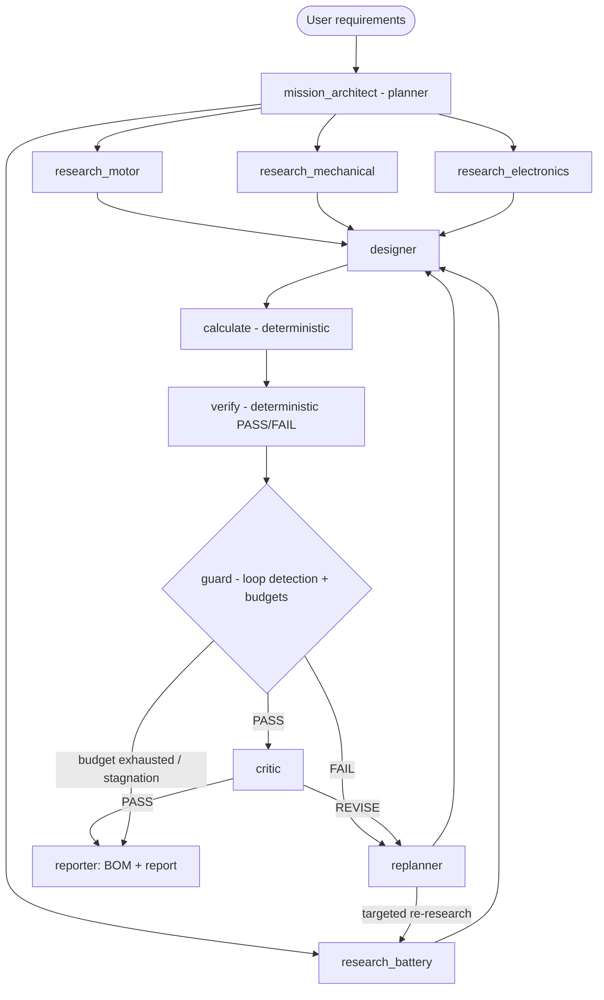

# HERMES - Autonomous Engineering Design & Verification Agent

**H**ierarchical **E**ngineering **R**easoning, **M**odeling & **E**valuation **S**ystem.
SDAIA Academy - Agentic AI Systems Engineering project, built on the official
[deep-research-agent-langgraph-project](https://github.com/SDAIAAcademy/deep-research-agent-langgraph-project) starter.

HERMES turns a natural-language engineering request into a researched, calculated, verified,
critiqued and iteratively improved design, with a Bill of Materials and an engineering report:

```
Requirements -> Research -> Design -> Calculate -> Verify -> Critique -> Replan -> Redesign
```

**LLM agents propose. Deterministic Python tools calculate. The verification engine decides PASS/FAIL.**
No engineering number in a HERMES report comes from an LLM.

> AI-generated engineering proposals - not certified engineering designs. Physical validation and
> qualified engineering review are required before real-world deployment.

## Architecture



| Component | Role |
|---|---|
| **Mission Architect** (`create_agent`) | Parses requirements into explicit / derived / assumed values and plans four research tasks |
| **4 Research Engineers** (`create_agent`, parallel) | Hybrid retrieval: SQLite component DB for numbers + Chroma RAG over datasheets for cited evidence |
| **Designer** (`create_agent`) | Chooses a complete parts list for the current strategy (economy -> balanced -> performance) |
| **Calculation engine** (Python) | BOM, forces, torque, linear DC-motor model, current, power, energy, runtime, mass, cost - every value with its formula |
| **Verification engine** (Python) | 20+ hard and soft constraint checks; the only component that decides PASS/FAIL |
| **Guard** (Python) | Given `LoopDetector` (repetition), stagnation detection (text + numeric), strategy ladder, budgets |
| **Replanner** (`create_agent`) | Diagnoses failures from the numbers, plans changes, triggers targeted re-research |
| **Critic** (`create_agent`) | Challenges passing designs (evidence, margins, compatibility); can send them back |
| **Reporter** | Deterministic Markdown report + BOM; the LLM writes only the executive summary |

## Setup

### On your own machine (recommended)

```bash
uv sync                       # Python 3.12 (.python-version), installs the hermes package + deps
cp .env.example .env          # paste your OPENROUTER_API_KEY into .env
uv run jupyter lab research_agent.ipynb
```

`uv` itself: see <https://docs.astral.sh/uv/getting-started/installation/>.

### Google Colab

1. Open `research_agent.ipynb` in Colab and set `REPO_URL` in the first code cell to your fork.
2. Add a secret named `OPENROUTER_API_KEY` (key icon in the left sidebar).
3. `Runtime -> Run all`. The first cell clones the repo and installs `hermes` (1-2 minutes).

Without a key the notebook still runs end to end: the mission is replayed with scripted agents
(clearly labelled), while the graph, tools, verifier, loop detection, budgets and checkpoints are the real code.

## Usage

```bash
uv run jupyter lab research_agent.ipynb       # main demo: setup, tools, agents, pipeline, run, checks
uv run pytest                                 # 75 offline tests (unit + integration), no API key needed
uv run python evaluation/run_missions.py      # live evaluation missions -> evaluation/results/
```

### Web UI (optional)

```bash
uv sync --extra ui
uv run --extra ui streamlit run app.py        # opens http://localhost:8501
```

`app.py` is a Streamlit front end over the same graph:
- **Input:** a request box with the evaluation missions as presets.
- **Modes:** live agents, or an offline scripted replay that needs no key.
- **Controls:** model and budget settings.
- **Live view:** the agents' decisions stream in while they work.
- **Results tabs:** BOM, verification checks, iteration history, RAG evidence with links, the full event log, and the engineering report (downloadable as Markdown).

The notebook remains the graded artifact. The UI helpers live in `src/hermes/ui_support.py` and are tested in
`tests/integration/test_ui.py`.

From Python:

```python
from hermes.agents.common import make_llm
from hermes.agents.team import LLMTeam
from hermes.graph import build_graph, run_mission

graph = build_graph(LLMTeam(make_llm()))
final = await run_mission(graph, "Design a small autonomous delivery robot with a 2 kg payload, ...")
print(final["final_status"]); print(final["report_md"])
```

## Live evaluation results

`evaluation/run_missions.py` runs the missions in `evaluation/missions.json` against the live agents
(`deepseek/deepseek-v4-flash` via OpenRouter) and writes one engineering report per mission plus
`evaluation/results/summary.md`:

| Mission | Purpose | Live result |
|---|---|---|
| `delivery-robot` | main demo (2 kg, 2 h, 1.5 m/s, 8 kg, 1,500 SAR) | **VERIFIED** - FAIL -> PASS in 2 design iterations, about 215k tokens, $0.014 |
| `infeasible` | requirements no catalogue combination can meet | **STAGNATED** (expected) - 5 designs, stagnation detected, best candidate reported with a human-review flag, $0.020 |
| `indoor-cart` | different requirements (1 kg, 4 h, 0.8 m/s, 1,200 SAR) | **VERIFIED** - FAIL -> PASS in 2 design iterations (1,107 SAR), about 210k tokens, $0.039 |

A mission costs roughly $0.015-0.04 and takes 5-13 minutes with this model. Every design and number in those
reports comes from the deterministic calculation engine and verifier, never from the LLM.

Failure behaviour seen in live runs and now covered by tests: agents that keep calling tools after their budget
(`ConvergeGuard`), a designer that re-proposes a failed parts list (rejected before calculation, then
`REPETITION DETECTED`), designs that oscillate between two near-misses (`STAGNATION DETECTED`, strategy ladder), a
critic asking for changes the catalogue cannot deliver (deterministic actionability gate), a revision that breaks a
verified design (the last verified design is reported), an LLM provider that runs out of credits
(`PROVIDER_ERROR`: the loop stops at once and the best candidate is reported), a planner that re-sends the same
rejected structured answer (`OutputLoopGuard`: the given `LoopDetector` replays the rejected answers, the model is
told which field to fix, and the run stops after three identical attempts), and a model that returns 0 for every
decimal below 1 ("0.8 m/s" -> 0). For that last case the numeric requirements are cross-checked against the
request text, zeroed values are repaired and recorded as assumptions, and contradictions become open questions.

## Rubric mapping (SDAIA `EVALUATION.md`)

| Category | How HERMES meets it | Where |
|---|---|---|
| **Agent Architecture (65)** | 7 `create_agent` roles; planner decomposition; 4-way parallel research; conditional routing; verify -> replan retry loop; critic quality loop; graceful handling of bad tool results and agent failures | `src/hermes/agents/team.py`, `src/hermes/graph/` |
| **Observability & Reliability (25)** | Given tracing/cost kept and extended to every node; given `LoopDetector` wired into tool calls (middleware) and design proposals (repetition); text + numeric stagnation; visible reaction (strategy change / graceful stop); step budgets per stage (`ToolCallLimitMiddleware`, `ModelCallLimitMiddleware`) and per mission; checkpointer memory with pause/resume | `src/hermes/observability/`, `src/hermes/tools/verification/loop_detector.py`, `src/hermes/graph/routing.py` |
| **Engineering Excellence (10)** | `uv`; notebook sections setup -> observability -> tools -> agents -> pipeline -> run -> checks; tested package; no secrets | `pyproject.toml`, `research_agent.ipynb`, `tests/` |
| **Bonus: full RAG (+15)** | Datasheet ingestion -> section-aware chunking -> local ONNX embeddings -> Chroma -> metadata-filtered retrieval -> cited evidence (source, section, page, URL, component ids) | `src/hermes/tools/research/rag.py`, `src/hermes/knowledge/datasheets/` |

The notebook's final section has a criterion-by-criterion self-audit with file and test references.

## Project structure

```
research_agent.ipynb          # the graded notebook (imports the hermes package)
app.py                        # optional Streamlit web UI (uv run --extra ui streamlit run app.py)
EVALUATION.md                 # SDAIA rubric (unchanged)
RUBRIC_IMPLEMENTATION_PLAN.md # rubric -> implementation mapping
pyproject.toml / uv.lock      # uv-managed dependencies
src/hermes/
  agents/        prompts.py, team.py (create_agent), common.py (run_agent, loop guard), briefs.py, scripted.py
  graph/         state.py (typed state + reducers), nodes.py, routing.py, workflow.py
  tools/
    engineering/ dynamics.py, motor.py, battery.py, bom.py, calculator.py
    verification/ verifier.py, loop_detector.py
    research/    component_db.py (SQLite), rag.py (Chroma), tools.py (LangChain tools), web.py (given)
  observability/ tracing.py (given), events.py
  knowledge/     components.csv (36 parts), datasheets/*.md (RAG corpus)
  models/        Pydantic models: requirements, components, design, verification, agent outputs
  report.py      deterministic engineering report
  ui_support.py  helpers for the web UI (event feed, result tables)
tests/           unit/ and integration/ (offline)
evaluation/      missions.json, run_missions.py, results/
```

## Data and evidence

- `src/hermes/knowledge/components.csv`: 36 parts. 32 are real catalogue items (Pololu, Adafruit, Ovonic) with specs
  taken from vendor pages and datasheets on 2026-10-07, each with its source URL. Specs a vendor does not publish are left
  empty and reported as "Specification not verified." Four structural items (chassis plates, payload bin, wiring
  allowance) are explicitly marked `assumed`.
- Prices are single-unit USD list prices converted at the fixed 3.75 SAR/USD peg; shipping, customs and VAT are excluded.
- The RAG corpus contains curated excerpts (not full vendor PDFs), each tagged with source URL, page and component ids.
- RAG footprint: `chromadb` adds about 300 MB of packages and downloads an 80 MB ONNX embedding model on first use.
  No PyTorch, no server, no extra API key.

## Limitations

- Motor behaviour uses a linear brushed-DC model built from extrapolated stall values.
- Energy results depend on the mission-profile assumptions (cruise speed, grade, rolling resistance), which are listed in every report.
- The catalogue is small and curated; HERMES selects only from parts it can cite.
- Results from live LLM runs vary between runs. The deterministic verifier keeps every reported design honest, but the path taken can differ.
- Final statuses: `VERIFIED`, `BUDGET_EXHAUSTED`, `STAGNATED`, `UNRESOLVED`, `FAILED` (requirements could not be parsed)
  and `PROVIDER_ERROR` (the LLM provider refused requests, e.g. no credits). Only `VERIFIED` means every specified
  computational constraint passed, and even then physical validation is required.

## How to submit (SDAIA)

1. **Fork** the starter repository, push this project to your fork, and set `REPO_URL` in the notebook.
2. Commit `research_agent.ipynb` **with outputs** from a live run, plus the package, tests and README.
   Never commit `.env` (it is in `.gitignore`).
3. Add the academy tag line below with your name, then commit and push.

Submitted by: Muhammad Jamil Almutairi — academy: @SDAIAAcademy
