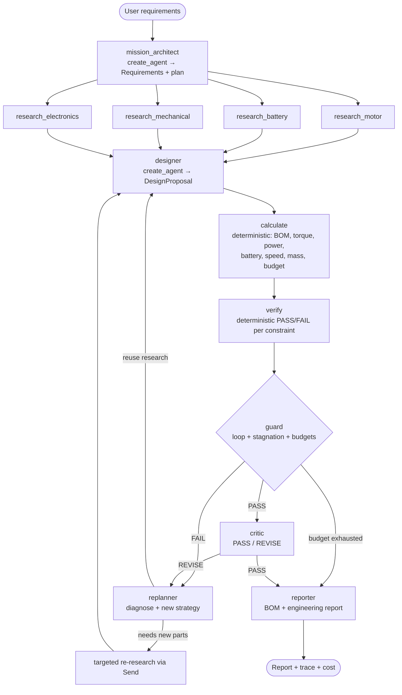

# HERMES — Rubric Implementation Plan

**Hierarchical Engineering Reasoning, Modeling & Evaluation System**
*Autonomous Engineering Design & Verification Agent*

Source of truth: `EVALUATION.md` from
[SDAIAAcademy/deep-research-agent-langgraph-project](https://github.com/SDAIAAcademy/deep-research-agent-langgraph-project)
(commit `c69df6c`). Locked stack: `langchain 1.4.0`, `langchain-core 1.6.3`,
`langgraph 1.2.11`, `langgraph-checkpoint 4.2.0`, `langchain-openai 1.6.2`,
model `deepseek/deepseek-v4-flash` via OpenRouter.

---

## 1. What the rubric actually says

The rubric is **band-based**, not a line-item checklist. Pass line: **80/100**.

| Category | Pts | Top band ("Excellent") wording, quoted |
|---|---|---|
| 1. Agent Architecture | 65 (52–65) | "Multi-agent graph with at least one non-sequential pattern: parallel stages (asyncio.gather or parallel StateGraph edges), a fact-check retry loop back to the researcher, a planner that decomposes the query, or conditional routing. **Runs reliably and handles bad tool results gracefully.**" Key focus: "Agent loop (**create_agent**), tool integration, multi-agent graph design". |
| 2. Observability & Reliability | 25 (22–25) | "**LoopDetector** wired into your pipeline (**repetition AND stagnation**) with a **visible reaction** (retry/warn), plus **one reliability extension** such as checkpointer memory or a step budget per stage." Tracing, tokens and real cost are *given*; only additions score. |
| 3. Engineering Excellence | 10 (9–10) | "Uses **`uv`**. Clear **notebook structure with separated concerns (setup, tools, agents, pipeline, checks)**. Clean **README** with setup and usage instructions." Poor band explicitly penalises **hard-coded secrets**. |
| Bonus | +15 | "Implement a **full RAG** (Retrieval-Augmented Generation) system." |

Hard cap: a straight researcher → analyst → writer chain stays in the
Satisfactory band (≤ 38) and **cannot pass**.

Submission mechanics (README): fork → finish `research_agent.ipynb` → push →
add `Submitted by: <name> — academy: @SDAIAAcademy` to the README. The
**notebook is the graded artifact**; Colab is the "easiest" grader path.

---

## 2. Rubric → implementation mapping

Paths are planned (not yet created). "NB §" = notebook section.

### 1. Agent Architecture (target 65/65)

| Rubric criterion | Implementation | File | Test | Demonstration |
|---|---|---|---|---|
| Agents built with `create_agent` (key focus) | Every LLM agent (mission architect, 4 researchers, designer, replanner, critic, reporter) is a `create_agent(...)` with a system prompt, tools where relevant, and `response_format=<Pydantic model>` for structured output | `src/hermes/agents/*.py` | `tests/unit/test_agents_build.py` (agents compile, schemas valid) | NB §4 Agents |
| Tool integration | Tools: `search_components` (SQLite filter), `search_datasheets` (RAG), given `search_web` / `read_webpage`, deterministic engineering calculators exposed as tools to the replanner | `src/hermes/tools/**` | `tests/unit/test_component_search.py`, `test_rag.py` | NB §3 Tools (each tool invoked standalone) |
| Multi-agent graph | `StateGraph(HermesState)` with 10+ nodes | `src/hermes/graph/workflow.py` | `tests/integration/test_workflow.py` | NB §5 renders the Mermaid graph |
| Planner that decomposes the query | `mission_architect` → structured `Requirements` (explicit / derived / assumptions / unknowns) + per-domain research plan | `agents/planner.py` | integration test asserts plan has 4 domains | NB §6 trace step [1]–[2] |
| Parallel stages | Static fan-out edges `mission_architect → {research_motor, research_battery, research_mechanical, research_electronics}` and fan-in to `designer`; `Annotated[..., reducer]` on `research_results` / `evidence` | `graph/workflow.py`, `graph/state.py` | integration test asserts all 4 ran in one superstep | NB §6 trace shows 4 concurrent research spans |
| Conditional routing | `route_after_verify` (PASS → critic, FAIL → replanner, budget/stagnation → reporter w/ best candidate), `route_after_critic` (PASS → reporter, REVISE → replanner), `route_after_replan` (targeted re-research via `Send` to only the affected domain, or straight to designer) | `graph/routing.py` | `tests/unit/test_routing.py` (pure functions, every branch) | NB §6 iteration history |
| Retry / quality loop | verify FAIL → diagnose → replan → redesign → recalc → re-verify; critic REVISE → replan | `graph/workflow.py`, `agents/replanner.py`, `agents/critic.py` | integration: scripted FAIL→PASS and REVISE→PASS paths | NB §6: Design #1 FAIL → #2 PASS → critic → #3 |
| "Runs reliably" | Deterministic calc/verify nodes; Pydantic validation of every LLM output; designer may only reference component IDs that exist in the DB (validated, rejected with feedback otherwise); explicit `recursion_limit` | `graph/workflow.py`, `tools/verification/` | integration test runs offline end-to-end | Committed notebook outputs from a real run |
| "Handles bad tool results gracefully" | Tools return error strings, never raise into the agent (pattern from given `search_web`); `ToolRetryMiddleware` for transient failures; unknown part IDs, missing specs ("Specification not verified"), empty RAG hits, failed web search all handled and logged in `state.errors` | `tools/**`, `agents/common.py` | `test_component_search.py::test_unknown_id`, `test_rag.py::test_empty_hit`, integration test with a failing tool | NB §8 fault-injection cell |

### 2. Observability & Reliability (target 25/25)

| Rubric criterion | Implementation | File | Test | Demonstration |
|---|---|---|---|---|
| Given tracing preserved | `observe`, `langfuse_context`, `Span`, `print_tree`, `run_agent` moved **verbatim** and marked "given by SDAIA starter"; `run_agent` extended (not replaced) to also return `structured_response` | `src/hermes/observability/tracing.py` | `test_tracing.py` (span tree + cost aggregation) | NB §2 |
| Full-mission trace tree | `@observe` also on deterministic nodes (calculate, verify, guard) so one tree shows LLM and tool work with tokens + real OpenRouter cost per agent; mission totals | `observability/tracing.py`, nodes | `test_tracing.py` | NB §6 trace tree, NB §7 cost table |
| LoopDetector — **repetition** | Given `LoopDetector.check_tool_call` wired into every research agent through a `wrap_tool_call` middleware: on exact/fuzzy repeat the tool is **not executed** and the agent receives "Loop detected … change your approach" | `tools/verification/loop_detector.py`, `agents/common.py` | `test_loop_detector.py` (exact + fuzzy) and middleware test with a scripted repeated call | NB §6 warning lines; NB §8 forced-repetition cell |
| LoopDetector — **design repetition** | Design fingerprint (sorted component IDs + key parameters): re-proposing an already-verified design is rejected and the designer is told why | `loop_detector.py` | `test_loop_detector.py::test_design_repeat` | NB §8 |
| LoopDetector — **stagnation** | Given `check_output_stagnation` on designer rationale **plus** numeric `MetricStagnation`: if the worst normalised constraint margin improves < ε over a window of 3 designs → `STAGNATION DETECTED — changing strategy` and the strategy ladder escalates (economy → balanced → performance → relax-soft-preferences) | `loop_detector.py`, `graph/routing.py` | `test_loop_detector.py::test_metric_stagnation` (1.20 h, 1.21 h, 1.20 h) | NB §6 / NB §8 |
| Visible reaction | Every detection appends a numbered event to the mission log and prints it; reaction is retry with changed strategy, or graceful stop | `observability/events.py` | asserted in integration test | NB §7 "Reliability events" table |
| Step budget per stage | `ToolCallLimitMiddleware` per research agent (given pattern), `ModelCallLimitMiddleware` per agent, graph-level `MAX_DESIGN_ITERATIONS=5`, `MAX_CRITIC_REVISIONS=2`, `MAX_TOTAL_STEPS=30`, plus `recursion_limit` as last-resort guard | `config.py`, `agents/common.py`, `graph/routing.py` | `test_routing.py::test_budget_exhausted`, integration: infeasible mission terminates | NB §8: infeasible mission → `DESIGN BUDGET EXHAUSTED — best candidate #k — human review required` |
| Checkpointer memory | Graph compiled with `InMemorySaver` + `thread_id`; NB shows `get_state_history()` (one snapshot per iteration) and resumes a mission from a checkpoint. Optional `SqliteSaver` (separate package `langgraph-checkpoint-sqlite`) only if cross-session resume is wanted | `graph/workflow.py` | integration: state history length, resume | NB §7 checkpoint table |

### 3. Engineering Excellence (target 10/10)

| Rubric criterion | Implementation | File | Test | Demonstration |
|---|---|---|---|---|
| `uv` | Keep `pyproject.toml` + `uv.lock`; add `.python-version` (3.12) so wheels for Chroma/ONNX exist; `uv sync`, `uv run pytest` | `pyproject.toml`, `uv.lock` | CI-equivalent: `uv run pytest` | README |
| Notebook separated concerns | Sections exactly: **Setup → Observability → Tools → Agents → Pipeline → Run → Checks → Reliability demos**; logic lives in `src/hermes`, notebook imports and demonstrates it | `research_agent.ipynb` | notebook executes top-to-bottom (`nbconvert --execute`, manual) | Committed with outputs |
| README | Setup (local uv + Colab), usage, architecture diagram, rubric self-audit table, limitations, submission line | `README.md` | — | — |
| No hard-coded secrets | Key from Colab Secrets / `.env` / getpass (given pattern); fix the uncommented `*** Optional overrides` line in `.env.example`; `.gitignore` covers `.env`, vector store, DB build artefacts | `.env.example`, `.gitignore` | `test_no_secrets.py` (grep for key patterns) | — |
| Tests | Unit (formulas, verifier, loop detector, routing, DB, RAG) + offline integration test of the full graph with scripted agents | `tests/` | `uv run pytest` | README badge/line |

### Bonus: Full RAG (+15)

| Rubric criterion | Implementation | File | Test | Demonstration |
|---|---|---|---|---|
| Document ingestion | Curated datasheet excerpts (Markdown, one file per part, front-matter: part number, source URL, page, retrieved date) | `src/hermes/knowledge/datasheets/*.md`, `tools/research/rag.py::load_documents` | `test_rag.py::test_load` | NB §3 |
| Chunking | `RecursiveCharacterTextSplitter` (section-aware), chunk metadata keeps file + page + section | `rag.py::chunk_documents` | `test_rag.py::test_chunk_metadata` | NB §3 chunk stats |
| Embeddings | Local embedding model (no extra API key) — see Decision D3 | `rag.py` | `test_rag.py` | NB §3 |
| Vector database | Chroma `PersistentClient` at `.hermes/chroma` (rebuilt idempotently) | `rag.py::build_index` | `test_rag.py::test_build_idempotent` | NB §3 |
| Retrieval | `search_datasheets(query, part_number=None, k=4)` tool, metadata filter by part | `rag.py`, `tools/research/component_search.py` | `test_rag.py::test_retrieves_correct_part` | NB §6 research spans |
| Hybrid with structured DB | SQLite `components` table (built from reviewable `components.csv`) for numeric filtering; RAG for evidence; researcher merges both into `Candidate` objects | `tools/research/component_search.py`, `knowledge/components.csv` | `test_component_search.py` | NB §3 |
| Evidence / citations | Every value carries provenance: `SOURCED(file, page)` / `CALCULATED(formula)` / `ASSUMED(id)` / `INFERRED`; unverifiable → "Specification not verified." | `models/evidence.py`, `agents/reporter.py` | `test_report.py::test_every_spec_has_provenance` | Report "Sources / Evidence" |

---

## 3. Target architecture

**Division of labour (non-negotiable):** LLM agents interpret, plan, choose
and critique. Deterministic Python computes every number and the verifier alone
decides PASS/FAIL. The critic can only send a design *back*; it can never pass a
design the verifier failed.

**Honest demo failure:** the designer's strategy ladder starts at *economy*
(cheapest parts satisfying per-part filters). For the delivery-robot mission
this plausibly undersizes the battery, so Design #1 fails runtime on its own
merits. Nothing is rigged; if a run happens to pass first time the notebook
still shows the loop via the infeasible-mission and fault-injection cells.

---

## 4. Build order (adapted from the 14 phases)

The structured component DB is pulled forward: the designer and calculators
cannot be exercised without real parts.

| # | Phase | Exit criterion |
|---|---|---|
| 1 | Rubric analysis (this file) | Approved by user |
| 2 | Repo scaffold: fork clone, `uv`, `src/hermes`, given helpers moved verbatim, `.env.example` fix | `uv run pytest` green on empty suite; notebook Setup cell runs |
| 3 | Models + state (`Requirements`, `Component`, `DesignProposal`, `CalcResult`, `ConstraintResult`, `HermesState`) | unit tests |
| 4 | Deterministic engineering tools (torque, power, battery, speed, mass, budget, SAR conversion) | hand-checked unit tests |
| 5 | Structured component DB + `search_components` with sourced data | DB tests; every row has a source |
| 6 | Verifier + routing functions | every branch unit-tested |
| 7 | Agents (`create_agent` + prompts + middleware) and graph wiring | offline integration test with scripted agents |
| 8 | Replanner, critic, strategy ladder | FAIL→PASS and REVISE paths tested |
| 9 | LoopDetector wiring (tool repetition, design repetition, stagnation) | detector tests + visible events |
| 10 | Budgets + checkpointer | budget-exhausted test, state history test |
| 11 | RAG (ingest, chunk, embed, Chroma, retrieve) + evidence tracking | RAG tests |
| 12 | BOM + report | provenance test |
| 13 | Evaluation missions + live run, notebook with committed outputs, README, self-audit | grader can read results without running |
| 14 | Optional extras (only if 1–13 are done) | — |

---

## 5. Explicitly out of scope (and why)

| Not adding | Reason |
|---|---|
| Docker, Postgres, Redis, Qdrant server, cloud services | Grader must run `uv sync` or Colab only |
| Real Langfuse | Rubric gives the stub; no points for swapping it, adds an account dependency |
| SciPy | All formulas are closed-form; NumPy optional |
| Web UI / Streamlit | Not graded; notebook is the artifact |
| CAD, vision, hardware | Phase 14 only, never at the cost of core items |
| Live-scraped specs as authoritative data | Non-deterministic and unverifiable; web results are labelled "unverified web evidence" and never feed the verifier |
| Whole vendor PDFs in the repo | Licensing + size; curated excerpts with source URL/page instead |

---

## 6. Grading risks and mitigations

| Risk | Impact | Mitigation |
|---|---|---|
| Notebook is the graded artifact; code moved to `src/` is invisible in Colab unless the repo is cloned | Grader sees `ImportError` or "where is the work?" | Colab bootstrap cell clones the fork and `pip install -e .`; notebook shows agent prompts, graph wiring and the Mermaid diagram inline; outputs committed (Decision D1) |
| Rubric key focus is `create_agent` | Hand-rolled LLM calls may read as "not using the agent loop" | Every LLM role is a `create_agent` agent |
| LoopDetector reaction never fires in the live run | Grader cannot see "visible reaction" | Wired in the pipeline **and** a deterministic reliability-demo section that forces repetition and stagnation |
| Live LLM non-determinism (no failure on run, bad structured output from a flash model) | Weak demo, crashes | Pydantic validation + `ModelRetryMiddleware`; committed outputs from a good run; offline integration tests |
| LangGraph default `recursion_limit` (25) hit by loops | `GraphRecursionError` instead of graceful stop | Own budgets stop earlier; explicit `recursion_limit` in config |
| Parallel branches writing the same state key | `InvalidUpdateError` | Reducers on all fan-in keys |
| Fabricated component specs or prices | Undermines "engineering credibility" and the spec's own rule | Every DB row needs a source URL; prices stored in USD from the vendor page and converted at the SAR/USD peg (3.75) with a snapshot date |
| Heavy RAG deps (Chroma/ONNX) on Python 3.14 (this machine) or slow Colab install | Install failures | Pin Python 3.12 via `uv`; choose the lightest embedding option (D3) |
| `uv` not installed on this machine | Cannot meet the `uv` criterion locally | Install uv (Decision D4) |
| Ambiguous requirements (e.g. is the 2 kg payload inside the 8 kg mass limit?) | Silent wrong assumption | Mission architect must list it as an explicit assumption; verifier reads the assumption, report shows it |
| Scope creep from a 30-section spec | Unfinished core | Build order above; extras last |
| Submission mechanics (fork, README line) | Ungraded submission | Checklist in README; final self-audit |

---

## 7. Decisions (resolved)

| ID | Decision | Outcome |
|---|---|---|
| D1 | Code layout | **Approved.** Logic in `src/hermes`; the notebook imports it (Colab bootstrap cell) and shows prompts, graph wiring, trace and outputs |
| D2 | Repository | **Not yet.** Local work only; no fork, push or publishing until explicitly authorised. A local `git init` was done (no commits) |
| D3 | Embeddings | **Approved after validation.** Chroma 1.5.9 + local ONNX all-MiniLM-L6-v2 works on Python 3.12 at the project path. Footprint ~300 MB packages + 80 MB model, no PyTorch/server/key. RAG is imported lazily so fast tests never load it |
| D4 | Tooling | **Done.** uv 0.12.23 installed via the official installer; project pinned to Python 3.12 (`.python-version`) |

Implementation note: the structured component DB was pulled forward (build order step 5 before agents), as planned in section 4.

---

## 8. Self-audit (completed 2026-10-08)

Evidence = implementation + an offline test that passes (`uv run pytest`: **75 passed**) + where it shows up in
the notebook or in a live run. `[x]` = implemented and tested; `[~]` = done but with the caveat given.

### Agent Architecture (65)

| Criterion | Status | Implementation | Test / evidence |
|---|---|---|---|
| Multi-agent graph | [x] | 7 LLM roles + 3 deterministic nodes in a `StateGraph` (`graph/workflow.py`) | `test_full_mission_fail_replan_pass_critic_revise`; notebook 5 (mermaid) |
| `create_agent` agent loop | [x] | every LLM role in `agents/team.py::LLMTeam` | `test_create_agent_designer_returns_validated_structured_output`, `test_create_agent_researcher_loop_guard_blocks_repeated_tool_calls` |
| Planner decomposes the query | [x] | `mission_architect` -> `MissionSpec` + 4 research tasks; profile overrides validated (`models/requirements.py::MissionDraft.to_spec`) | `tests/unit/test_mission_spec.py`; live: requirements parsed correctly in every run |
| Parallel stages | [x] | 4-way fan-out `route_after_architect`, reducers in `graph/state.py` | full-mission test (4 research calls before the first design) |
| Conditional routing | [x] | `decide_after_verify`, `route_after_*` | `tests/unit/test_routing.py` (every branch) |
| Retry / quality loop | [x] | verify -> replan -> redesign; critic -> replan; targeted re-research | full-mission test; live delivery-robot: FAIL -> PASS |
| Tool integration | [x] | SQLite DB tools, RAG tool, engineering calculators, given web tools | `test_tools_return_specs_with_citations` |
| Bad tool results / agent failures handled | [x] | tools return messages, every LLM node has a deterministic fallback, `ProviderError` stops cleanly | `test_tools_return_messages_for_bad_input`, `test_research_agent_failure_falls_back_to_database`, `test_planner_failure_ends_gracefully`, `test_provider_out_of_credits_stops_the_mission_cleanly` |

### Observability & Reliability (25)

| Criterion | Status | Implementation | Test / evidence |
|---|---|---|---|
| Given tracing / tokens / cost kept | [x] | `observability/tracing.py` (verbatim) + `span_totals`; every node and agent is a span | `test_span_totals_sum_children`; live traces show real tokens and $ |
| LoopDetector - repetition | [x] | tool calls (`loop_guard_middleware`), design proposals (`detect_design_repetition`), pre-calculation duplicate check | `test_loop_guard_blocks_third_identical_call`, `test_repeated_design_triggers_loop_detection_and_graceful_stop`; fired live |
| LoopDetector - stagnation | [x] | text stagnation (given) + `MetricStagnationDetector` on verification scores | `tests/unit/test_loop_detector.py`, `test_metric_stagnation_escalates_then_stops_at_top_of_ladder`; fired live |
| Visible reaction | [x] | `!!` events, strategy ladder, graceful stop with best candidate, critic gate | notebook 8.1-8.5; live logs |
| Step budget per stage | [x] | `ToolCallLimitMiddleware` per tool, `ModelCallLimitMiddleware`, `ConvergeGuard`, design/critic/research/step budgets (`config.py::Budgets`) | `test_design_budget_is_enforced`, `test_step_budget_exhausted`, `test_converge_guard_strips_tools_when_budget_is_spent` |
| Checkpointer memory | [x] | `InMemorySaver`, `interrupt_before` + resume | `test_checkpointer_persists_every_step`, `test_checkpoint_pause_before_critic_and_resume`; notebook 7 and 8.4 |

### Engineering Excellence (10)

| Criterion | Status | Evidence |
|---|---|---|
| `uv` | [x] | `pyproject.toml`, `uv.lock`, `.python-version` |
| Notebook structure (setup, tools, agents, pipeline, checks) | [x] | `research_agent.ipynb` sections 1-9; executes end to end offline with 0 errors |
| README with setup and usage | [x] | `README.md` |
| Tests | [x] | 75 offline tests (unit + integration, including an end-to-end Streamlit UI test) |
| Web UI (extra, not graded) | [x] | `app.py` (Streamlit, optional `ui` extra); helpers in `src/hermes/ui_support.py`; `tests/integration/test_ui.py` |
| No hard-coded secrets | [x] | `.env` git-ignored, `.env.example`; `test_no_api_keys_committed` |

### Bonus: full RAG (+15)

| Stage | Status | Implementation | Test |
|---|---|---|---|
| Ingestion (front matter metadata) | [x] | `rag.py::load_documents` | `test_documents_load_with_front_matter` |
| Chunking (section-aware, page/component/source per section) | [x] | `rag.py::chunk_documents` | `test_chunks_keep_citation_metadata` |
| Embeddings (local ONNX MiniLM) + vector DB (Chroma, persistent, idempotent) | [x] | `DatasheetIndex` | `test_index_build_and_retrieval` |
| Retrieval (semantic + component-id metadata filter, thread-safe) | [x] | `DatasheetIndex.search`, `get_index` | `test_concurrent_first_use_from_worker_threads` |
| Citations in the output | [x] | agent tool results harvested + one guaranteed passage per shortlisted part (`evidence_for_component`); report "Sources / Evidence" | `test_evidence_is_harvested_from_tool_output_not_llm_text`, `test_evidence_for_component_is_filtered_and_cited`; live: 6-15 cited facts per research domain |

### Open items (honest)

- [x] **Notebook outputs from a live run** (2026-10-08, `deepseek/deepseek-v4-flash`): VERIFIED, FAIL -> PASS, fuzzy loop detection and stage budgets fired, critic PASS with 4 limitations; 213k tokens, $0.038. No API key or local path in the saved outputs.
- [x] **All three evaluation missions met their expectations live** (`evaluation/results/summary.md`): delivery-robot VERIFIED, indoor-cart VERIFIED, infeasible STAGNATED (graceful stop); $0.073 in total. The indoor-cart runs exposed over-derived features and a model that returns 0 for decimals below 1; both are fixed (planner prompt, requirement cross-check against the request text, `OutputLoopGuard`).
- [ ] Commit, push to the fork and add the "Submitted by" line - waiting for the author's authorisation.
